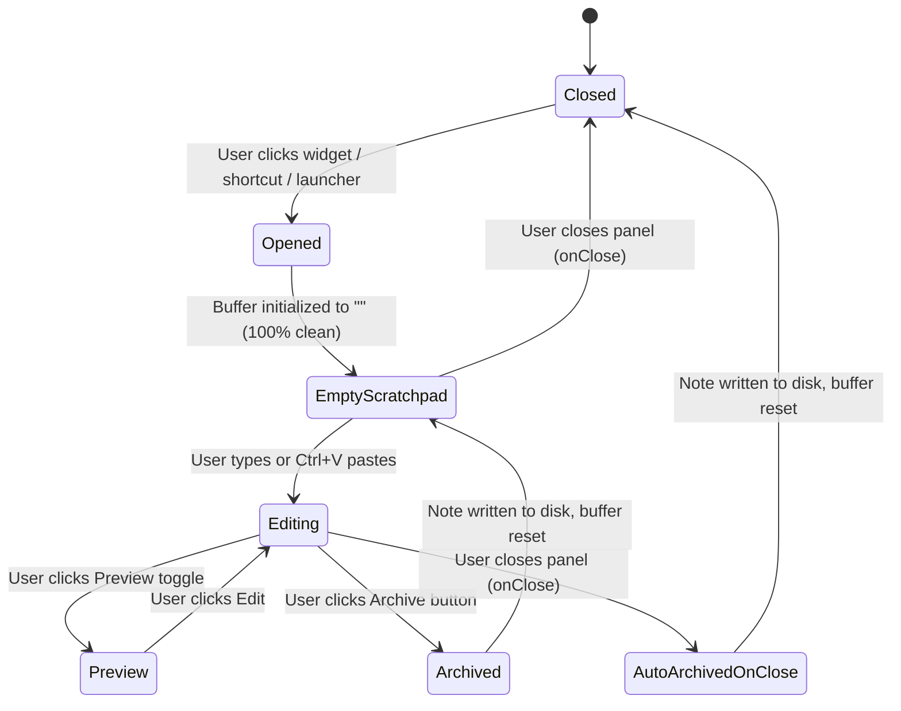

# Scratchpad Plugin Design Specification

* **Date:** 2026-10-02
* **Plugin ID:** `rigelyon/scratchpad`
* **Target Environment:** Noctalia Desktop Shell (Plugin API 28+)
* **Status:** Approved for Implementation

---

## 1. Problem Statement & Objectives

### Problem
The standard Noctalia `notes` plugin (`noctalia/notes`) suffers from several UX and functionality limitations:
1. **High friction for quick notes:** Opening the panel shows a list of files or requires manual clicking to create/open notes.
2. **No Markdown formatting or rich rendering:** Text is treated strictly as plain text without preview or formatting shortcuts.
3. **Privacy risk:** Opening the scratchpad in shared or public settings immediately exposes whatever sensitive information was left on screen from previous sessions.
4. **Sub-optimal UX & excessive clicks:** Basic tasks like copying all content, toggling preview, or archiving require repetitive actions.

### Objectives
1. **Zero-click instant capture:** Opening the panel immediately presents a clean, empty, auto-focused multiline editor ready for immediate typing or `Ctrl+V` pasting.
2. **Privacy preservation via Auto-Archive:** Any unsaved scratchpad content from a previous session is automatically archived into a timestamped/titled `.md` note in `Saved Notes` when the panel closes, guaranteeing the scratchpad opens 100% clean every time.
3. **Markdown engine & quick formatting:** Native Markdown rendering via Noctalia's `ui.markdown`, alongside a 1-click preview toggle and a compact Markdown formatting toolbar.
4. **Seamless note library:** A dedicated "Saved Notes" tab featuring fuzzy search, pinned notes, 1-click clipboard copy without opening, inline deletion, and seamless note switching.
5. **Full Noctalia ecosystem integration:** Bar widget for the status bar and launcher provider (`sp` prefix) for quick note lookups and instant capture from the global launcher.

---

## 2. Architecture & File Structure

The plugin resides under the `scratchpad/` subdirectory of the repository:

```text
scratchpad/
├── plugin.toml           # Manifest declaring settings, panel, widget, and launcher_provider
├── panel.luau            # Main UI implementation (Tabs, Scratchpad, Markdown preview, Notes list)
├── widget.luau           # Bar widget displaying status and toggling panel
├── launcher.luau         # Launcher provider (prefix 'sp' for search and quick capture)
├── translations/
│   ├── en.json           # English translation strings
│   └── id.json           # Indonesian translation strings
└── README.md             # Documentation, feature highlights, and configuration details
```

---

## 3. Configuration & Storage Specification

### Settings (`plugin.toml`)
* **`notes_dir`** (`folder`, default: `~/Documents/Scratchpad`): Directory where `.md` notes and `.pinned.json` reside.
* **`extension`** (`string`, default: `md`): Extension for note files (normalized without leading dot).
* **`auto_archive`** (`boolean`, default: `true`): Whether scratchpad text is automatically archived to a note upon panel close.

### File Storage Format
* All notes are saved as standard UTF-8 `.md` files in `notes_dir`.
* **Auto-Archive naming rule:**
  - If the first line is a valid heading (e.g. `# Note Title`) or short text (< 40 characters without filesystem-illegal characters), it is sanitized and used as filename (e.g., `Meeting Notes.md`).
  - Otherwise, uses timestamp format `YYYY-MM-DD HH.MM.SS.md`.
  - Collision resolution: Appends `(2)`, `(3)`, etc.
* **Pins sidecar (`.pinned.json`):**
  - Stored inside `notes_dir/.pinned.json`.
  - JSON map: `{ "<filename>": true }`.

---

## 4. UI/UX & Component Details

### 4.1. Panel Architecture (`panel.luau`)
* **Panel dimensions:** Width: `460px`, Height: `fill`, Placement: `floating`, Position: `center_right`.

#### Header & Segmented Tabs
* Top row contains a segmented tab switcher:
  * `[ 📝 Scratchpad ]` (Active by default)
  * `[ 📚 Saved Notes (N) ]` (Displays count of saved notes)
* Right-aligned action buttons:
  * **Preview Toggle (`eye` / `edit-3`):** 1-click toggle between Editor mode and Rendered Markdown view.
  * **Copy All (`copy`):** 1-click copy of current editor content to OS clipboard via `noctalia.copyToClipboard`.
  * **Archive / New Note (`archive` or `plus`):** Immediately saves current content to a note in `Saved Notes` and clears editor.
  * **Clear (`eraser`):** Clears the editor draft.
  * **Close (`x`):** Closes the panel.

#### Scratchpad Tab
* **Multiline Input (`ui.input`):**
  * `multiline = true`, `focus = true`, `flexGrow = 1`.
  * Placeholder: Configurable localized placeholder ("Type or paste markdown here...").
* **Markdown Action Toolbar (Above Editor):**
  * Compact horizontal row with chips:
    * `H` : Heading (`# `)
    * `B` : Bold (`**text**`)
    * `I` : Italic (`*text*`)
    * `[✓]` : Task item (`- [ ] `)
    * `</>` : Code block (`` `code` `` or multi-line block)
    * `"` : Quote (`> `)
    * `•` : List item (`- `)
* **Live Status Line:**
  * Shows word count and character count dynamically as user types (e.g. `Ready · 42 words · 250 characters`).

#### Markdown Preview Mode
* Renders `ui.scroll` wrapping `ui.markdown({ text = buffer })`.
* Preserves formatting: headings, code blocks, lists, bold/italic, tables.
* A floating or header button allows returning to editing with 1 click.

#### Saved Notes Tab
* **Fuzzy Search Input:** Real-time filter against note title and first lines.
* **Pinned Notes Section:** Pinned notes appear at top with distinct visual indicator.
* **Note Row Items:**
  * Note title and snippet preview (first line).
  * Modification time and word count badge.
  * **1-Click Actions:**
    * `copy`: Copies note content directly to clipboard without opening.
    * `pin` / `pinned-off`: Toggles pin status.
    * `trash`: Triggers inline 2-step confirmation (`check` / `x`).
    * Click row: Loads the note into Scratchpad (switching to editor/preview).

### 4.2. Bar Widget (`widget.luau`)
* Declarative bar widget displaying glyph `notes` (or `notebook`).
* Tooltip shows summary: `Scratchpad · N notes`.
* Click opens/toggles the panel.

### 4.3. Launcher Provider (`launcher.luau`)
* Prefix: `sp`.
* Empty query (`sp`): Lists pinned and recently modified notes.
* Query with text (`sp <query>`):
  * Option 1: "Quick Capture: '<query>'" -> Pressing Enter immediately creates and writes a new note with this content without opening the panel.
  * Option 2: Filtered matches from existing saved notes.

---

## 5. Privacy & State Machine



1. When panel closes (`onClose`), if `auto_archive` is true and `buffer` contains non-whitespace text, it saves to `notes_dir/<title>.md`.
2. When panel opens (`onOpen`), `buffer` is guaranteed empty and `ui.input` has `focus = true`.
3. If user opens a note from "Saved Notes", `buffer` loads that note and tab switches to Scratchpad.

---

## 6. Error Handling & Quality Assurance

* **Path & Directory checks:** Uses `noctalia.mkdirAll` on `onOpen`; fails gracefully with `noctalia.notifyError` if directory creation fails.
* **Safe JSON decode:** Pinned notes parser validates that `.pinned.json` decodes to a valid Lua table.
* **Luau CPU Limits:** Note list queries and file loading are cached or executed on-demand without blocking Noctalia's main thread.
* **Localization:** All user-facing strings are keyed through `noctalia.tr(key)` in `translations/en.json` and `translations/id.json`.

---

## 7. Verification Plan

1. **Manifest & Translation Validation:**
   * Run `python3 .github/workflows/validate-plugins.py` to ensure schema conformance.
   * Run `python3 -m unittest discover tests -v` for test suite compliance.
2. **Linting:**
   * Run `noctalia plugins lint scratchpad` to verify declared settings and bindings.
3. **Catalog Generation:**
   * Run `python3 .github/workflows/update-catalog.py` to index the new plugin into `catalog.toml`.
