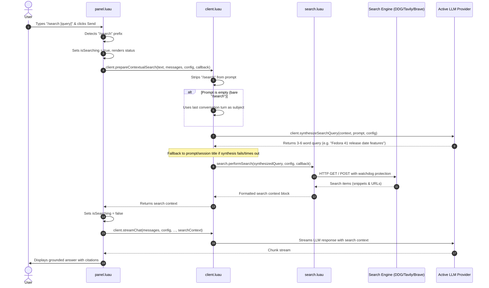

# Design Document: AI Sidebar Slash Search Command & Contextual Web Search

## 1. Overview
This design replaces the persistent global `enable_web_search` toggle with an on-demand `/search` slash command in the `ai-sidebar` plugin. Rather than requiring users to manually craft search engine queries or suffering from automatic web search executions on every casual message, users trigger contextual search with `/search` or `/search <question>`. The AI synthesizes an optimal 3-6 word search query from the conversation context, fetches results from the configured search engine (DuckDuckGo, Tavily, Brave), and streams the grounded response.

## 2. User Experience & Trigger Flow
1. **Command Syntax**:
   - `/search`: Triggers search based entirely on previous conversational context (e.g. following up on a topic already discussed).
   - `/search <optional prompt>`: Triggers search based on the provided question and conversational context.
2. **Display in Chat History**:
   - The user message retains the `/search` text as an explicit visual badge/indicator that live web retrieval was invoked for that turn.
3. **Casual & Normal Messages**:
   - Any message sent without `/search` (e.g., greetings, coding requests, general conversation) will never execute web search. They immediately stream directly from the LLM.
4. **Visual State**:
   - The status bar reflects `Searching the web...` during query synthesis and HTTP retrieval, transitioning smoothly to `Streaming...` once generation begins.

## 3. Architecture & Data Flow



### 3.1 Query Synthesis (`client.synthesizeSearchQuery`)
- Calls a lightweight, non-streaming titler-style completion:
  ```
  System: You are an expert web search query optimizer. Given the chat conversation context and the user's latest request, return ONLY a concise, high-yield search engine query (3 to 6 keywords). No quotes, no markdown, no explanations.
  ```
- Fast timeout (clamped at 2.5s) to guarantee zero latency penalty.
- Fallback: If synthesis times out or fails, gracefully extracts keywords from the user prompt or session title.

### 3.2 Error & Watchdog Protection
- Search execution maintains the existing 3.5s safety watchdog:
  - If network stalls or search fails, the watchdog automatically transitions to standard LLM generation without crashing or hanging the UI.

## 4. Settings & Storage Refactoring
1. **Remove Persistent Global Toggle**:
   - Remove `enable_web_search` toggle from the settings UI in `panel.luau`.
   - Remove `web_search_on_hint` / `web_search_off_hint` toggle buttons from settings.
2. **Retain Provider & Tuning Configuration**:
   - Retain search engine picker (`search_engine`: DuckDuckGo, Tavily, Brave).
   - Retain API key input (`search_api_key`) and max results slider (`search_max_results`).
3. **Storage Defaults**:
   - Ensure backward compatibility in `storage.luau` so legacy configs do not produce errors.

## 5. Verification & Testing Plan
1. **Unit Tests (`tests/test_ai_sidebar_slash_search.py` & `test_ai_sidebar_search.py`)**:
   - Test detection of `/search` and `/search <prompt>` in message parser.
   - Test fallback behavior when query synthesis returns empty or fails.
   - Test that normal messages do not trigger search.
   - Test settings serialization without `enable_web_search` toggle dependency.
2. **Static Analysis**:
   - Run `luau-lsp analyze --platform standard --defs noctalia.d.luau` across `panel.luau`, `client.luau`, `search.luau`, `storage.luau`.
3. **Test Suite**:
   - Run `python3 -m unittest discover tests` ensuring all tests pass with 0 regressions.
