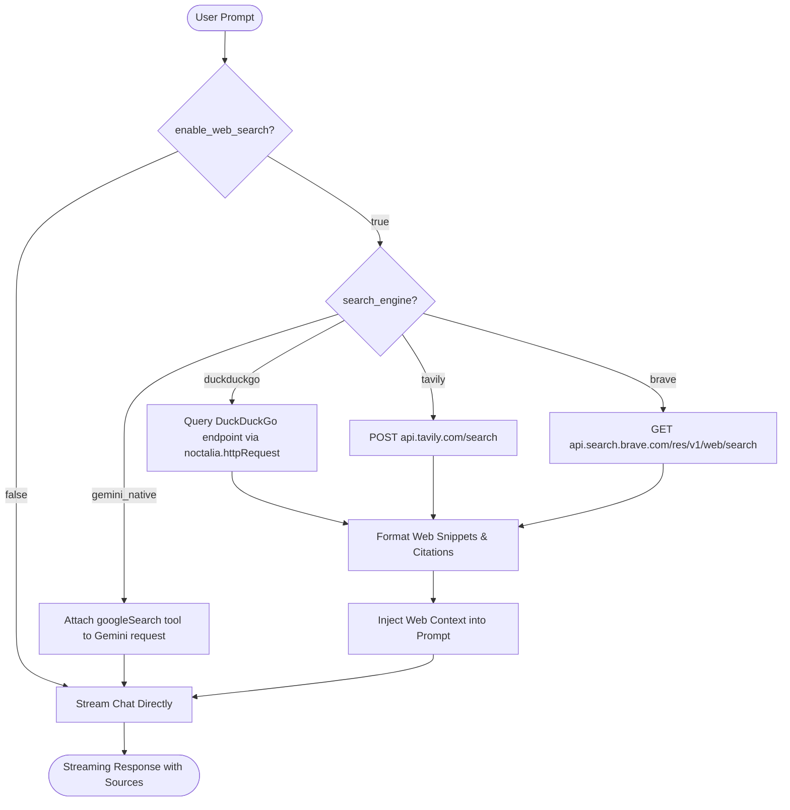

# AI Sidebar: Web Search Integration Design Spec

**Date:** 2026-10-03  
**Status:** Approved by User  
**Scope:** AI Sidebar Plugin for Noctalia  

---

## 1. Overview & Goals

The goal of this feature is to enable AI Sidebar to browse and search the internet for real-time information, current facts, and external sources before answering user queries.

### Key Goals
1. **User Control**: Web search is toggled via settings (`enable_web_search = false` by default) so users only pay token and latency costs when needed.
2. **Multi-Engine Support (Universal)**:
   - **DuckDuckGo**: Free, zero API key requirement, works out-of-the-box.
   - **Gemini Native Grounding**: Uses Google Search Grounding for Gemini API without extra fees or keys.
   - **Tavily Search API**: Tailored for AI agents and LLM search queries (requires API key).
   - **Brave Search API**: Independent, privacy-focused search engine (requires API key).
3. **Graceful Fallback & Status Transparency**:
   - Status transitions from `"Mencari di web..."` (`"Searching the web..."`) to `"Sedang mengetik..."` (`"Thinking..."`).
   - If search fails or times out, the chat continues without crashing, falling back to standard LLM generation with an informative indicator.
4. **Clean Code & Modular Design**:
   - Dedicated search engine abstraction in `search.luau`.
   - Comprehensive unit test coverage.
   - Foundation for future `/search <query>` slash command triggers.

---

## 2. Architecture & Components



---

## 3. Configuration & Storage (`plugin.toml` & `storage.luau`)

### 3.1 Settings Schema (`plugin.toml`)
New setting declarations under `[[panel]]` for `ai-sidebar`:
- `enable_web_search`: `bool`, default `false`.
- `search_engine`: `select`, options: `["duckduckgo", "gemini_native", "tavily", "brave"]`, default `"duckduckgo"`.
- `search_api_key`: `string`, default `""` (for Tavily / Brave).
- `search_max_results`: `select`, options: `["3", "5", "7"]`, default `"3"`.

### 3.2 Storage Config Shape (`storage.luau`)
Extend `ConfigTable` type definition:
```luau
export type ConfigTable = {
  active_provider: string,
  openai_key: string,
  openai_model: string,
  anthropic_key: string,
  anthropic_model: string,
  gemini_key: string,
  gemini_model: string,
  custom_base_url: string,
  custom_key: string,
  custom_model: string,
  system_prompt: string,
  -- Web search settings
  enable_web_search: boolean,
  search_engine: string,
  search_api_key: string,
  search_max_results: number,
}
```

Defaults initialized in `storage.loadConfig()`:
- `enable_web_search = noctalia.getConfig("enable_web_search") or false`
- `search_engine = noctalia.getConfig("search_engine") or "duckduckgo"`
- `search_api_key = noctalia.getConfig("search_api_key") or ""`
- `search_max_results = tonumber(noctalia.getConfig("search_max_results")) or 3`

---

## 4. Search Engine Module (`search.luau`)

A dedicated module `ai-sidebar/search.luau` handling all network interactions with search providers.

### 4.1 Exported Types & Interface
```luau
export type SearchResultItem = {
  title: string,
  url: string,
  snippet: string,
}

export type SearchResponse = {
  ok: boolean,
  query: string,
  engine: string,
  items: { SearchResultItem },
  error: string?,
}
```

### 4.2 Engine Implementations

#### 1. DuckDuckGo Search (`search.queryDuckDuckGo`)
- Endpoint: `https://api.duckduckgo.com/?q={query}&format=json&no_html=1&skip_disambig=1` and fallback to HTML lite parser if needed.
- Extracts `RelatedTopics`, `AbstractText`, `AbstractURL`, `Heading`.
- Parses results into clean `SearchResultItem` records.

#### 2. Tavily Search (`search.queryTavily`)
- Endpoint: `https://api.tavily.com/search` (POST).
- Headers: `Content-Type: application/json`.
- Body: `{"api_key": apiKey, "query": query, "max_results": maxResults, "include_answer": true}`.
- Extracts `results` array with `title`, `url`, `content`.

#### 3. Brave Search (`search.queryBrave`)
- Endpoint: `https://api.search.brave.com/res/v1/web/search?q={urlEncode(query)}&count={maxResults}`.
- Headers: `X-Subscription-Token: apiKey`, `Accept: application/json`.
- Extracts `web.results` array with `title`, `url`, `description`.

#### 4. Formatting Context (`search.formatSearchContext`)
Transforms `{ SearchResultItem }` into a markdown context block:
```text
[Web Search Results for: "<query>"]
1. [<title>](<url>)
   <snippet>
2. [<title>](<url>)
   <snippet>

Instructions: Incorporate the above live web search information into your response. Cite sources with markdown links where appropriate.
```

---

## 5. Provider & Client Integration (`client.luau` & `gemini.luau`)

1. **Gemini Native Search Grounding**:
   - In `providers/gemini.luau`: If `config.enable_web_search` is true and `config.search_engine == "gemini_native"`, append:
     ```json
     "tools": [
       { "googleSearch": {} }
     ]
     ```
   - Gemini handles retrieval and synthesis directly with built-in source grounding.

2. **Universal Ingestion (DuckDuckGo / Tavily / Brave)**:
   - In `client.streamChat()` or `panel.luau sendMessage()`:
     - If `config.enable_web_search` is true and not `(provider == "gemini" and engine == "gemini_native")`:
       - Call `search.performSearch(query, config, onComplete)`:
       - Update UI status to `tr("status_searching_web")`.
       - On completion: inject formatted context into latest user message or system instruction.
       - Continue streaming response via `client.streamChat()`.

---

## 6. UI & Settings Tab Updates (`panel.luau`)

### 6.1 Settings Tab Components
Under `renderSettingView()`:
1. **Section Header**: `tr("web_search_title")` with globe icon.
2. **Web Search Toggle**:
   - Label: `tr("enable_web_search")`.
   - `ui.toggle({ value = config.enable_web_search, onChange = ... })`.
3. **Search Engine Dropdown**:
   - Only shown / enabled when `config.enable_web_search` is true.
   - Options: `DuckDuckGo (Free)`, `Gemini Native (Google Search)`, `Tavily Search`, `Brave Search`.
4. **Search API Key Input**:
   - Only shown when engine is `tavily` or `brave`.
   - Password masked with visibility toggle eye button.
5. **Max Results Select**:
   - Options: `3 (Compact)`, `5 (Standard)`, `7 (Detailed)`.

### 6.2 Chat View Status
- During search execution:
  - `statusText = tr("status_searching_web")` ("Mencari di web..." / "Searching the web...").
- Once search completes and LLM streams:
  - `statusText = tr("status_typing")` ("Sedang mengetik..." / "Thinking...").

---

## 7. Localization (`en.json` & `id.json`)

New keys:
- `web_search_title`: `"Web Search"` / `"Pencarian Web"`
- `enable_web_search`: `"Enable Web Search"` / `"Aktifkan Pencarian Web"`
- `search_engine`: `"Search Engine"` / `"Mesin Pencari"`
- `search_engine_ddg`: `"DuckDuckGo (Free)"` / `"DuckDuckGo (Gratis)"`
- `search_engine_gemini`: `"Gemini Native (Google Search)"` / `"Gemini Native (Google Search)"`
- `search_engine_tavily`: `"Tavily Search (API Key)"` / `"Tavily Search (API Key)"`
- `search_engine_brave`: `"Brave Search (API Key)"` / `"Brave Search (API Key)"`
- `search_api_key`: `"Search API Key"` / `"Search API Key"`
- `search_max_results`: `"Max Search Results"` / `"Maksimal Hasil Pencarian"`
- `status_searching_web`: `"Searching the web..."` / `"Mencari di web..."`
- `search_error_fallback`: `"Web search failed, proceeding with offline model knowledge."` / `"Pencarian web gagal, melanjutkan dengan pengetahuan model."`

---

## 8. Testing Strategy

1. **Unit Tests in `tests/test_ai_sidebar_search.py`**:
   - Test search module exports (`queryDuckDuckGo`, `queryTavily`, `queryBrave`, `formatSearchContext`, `performSearch`).
   - Test JSON parsing and query encoding for Tavily, Brave, and DuckDuckGo.
   - Test context injection formatting with markdown links and truncation.
   - Test fallback behavior when HTTP request fails (`ok = false`).
2. **Integration Tests in `tests/test_ai_sidebar_storage.py` & `tests/test_ai_sidebar_panel.py`**:
   - Verify web search config fields persist and load correctly.
   - Verify UI components in settings and chat status indicators.
   - Verify Gemini native grounding tools payload construction.
